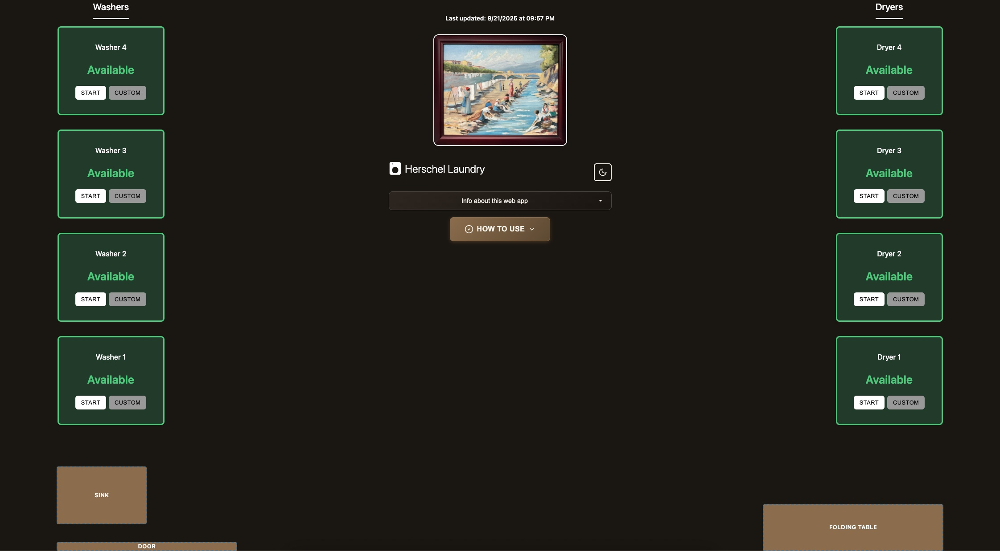
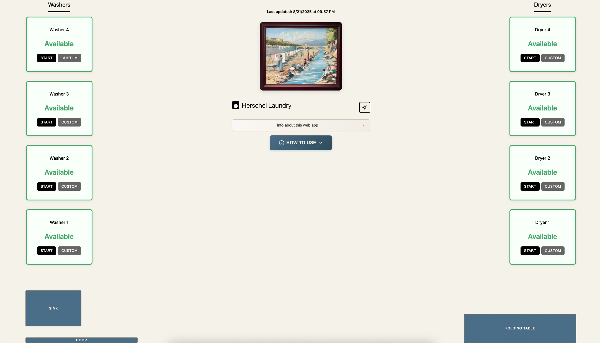
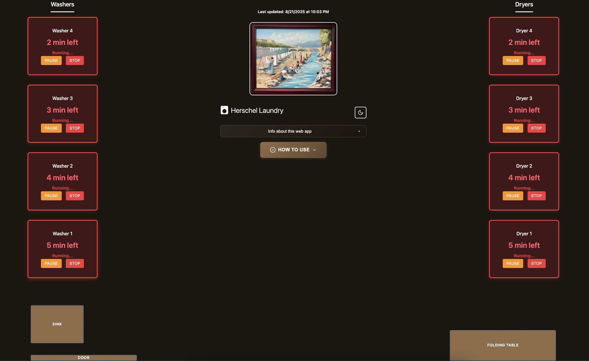
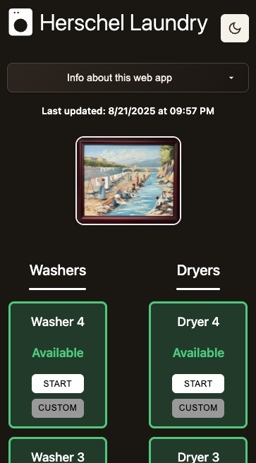
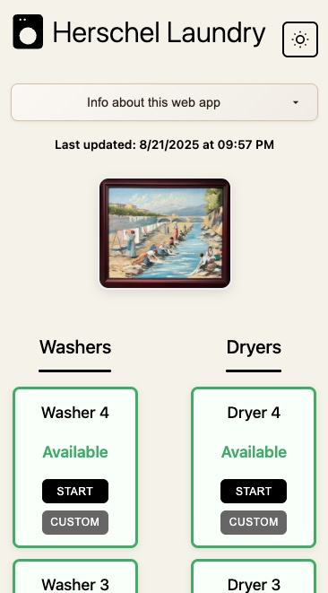

# Laundry Room Timer System


A realtime digital status board for apartment building laundry room management. A VISUAL coordination tool that shows neighbors which machines are in use and when they'll be available. Does NOT send notifications or make sounds - users must set their own phone timers.

## Screenshots

### Desktop Dashboard - Dark Theme

<div align="center">
  
  <p><em>Clean dark interface showing all 8 machines available with painting guide</em></p>
</div>

### Desktop Dashboard - Light Theme

<div align="center">
  
  <p><em>Light mode with automatic theme switching based on system preferences</em></p>
</div>

### Active Timers - All Machines Running

<div align="center">
  
  <p><em>Realtime countdown display showing red status when all machines are in use</em></p>
</div>

### Mobile Experience - Dark Theme

<div align="center">
  
  <p><em>Mobile-first responsive design with painting layout guide</em></p>
</div>

### Mobile Experience - Light Theme

<div align="center">
  
  <p><em>Light theme mobile interface for easy neighbor coordination</em></p>
</div>

## Overview

Web application designed for real apartment building laundry room with 4 washers and 4 dryers. Provides realtime machine status updates with zero operational costs through Firebase infrastructure and hosting.

## Features

### Core Functionality

- Realtime machine status dashboard with room accurate layout
- One click standard timers (29 minutes for washers, 60 minutes for dryers)
- Custom timer option (1-120 minute range)
- Client side countdown with 1 second visual updates
- Automatic timer expiration and state management
- Pause/resume functionality for active timers with millisecond precision

### User Experience

- Mobile first responsive design
- Dark/light theme toggle with system preference detection
- Room layout mirroring physical machine positions
- Visual status indicators (Available, Running, Almost Done, Paused)
- No user accounts or complex forms required
- Accessibility support with ARIA labels
- Real-time visual feedback and animations

### Advanced Features

- Realtime Firebase synchronization with atomic transactions
- Enterprise-grade error handling and validation
- Rate limiting and security measures
- Circuit breaker pattern for resilient operations

## Technical Architecture

### Frontend Stack

- **Framework**: Vanilla JavaScript with ES6 modules
- **Build Tool**: Vite for development and production builds
- **CSS**: Custom responsive design with CSS Grid and Flexbox
- **Code Quality**: ESLint and Prettier for code formatting and linting
- **Browser Support**: Comprehensive compatibility handling

### Backend Infrastructure

- **Database**: Firebase Realtime Database
- **Authentication**: Firebase Anonymous Authentication

### Deployment

- **Hosting**: Firebase static site hosting
- **Domain**: Custom domain support optional
- **SSL**: Automatic HTTPS certificates

## Project Structure

```
laundry-timer/
├── css/
│   ├── styles.css           # Main application styles
│   └── responsive.css       # Mobile responsive design
├── js/
│   ├── app.js              # Main application orchestration
│   ├── firebase-service.js  # Firebase integration layer
│   ├── firebase-config.js   # Firebase configuration
│   ├── timer.js            # Timer management and display logic
│   ├── modal.js            # Modal dialog management
│   └── browser-compatibility.js  # Cross browser support
├── assets/                # Static assets and images
├── index.html             # Application entry point
├── database.rules.json    # Firebase security rules
├── firebase.json          # Firebase project configuration
├── vite.config.js         # Vite build configuration
├── .eslintrc.json         # ESLint configuration
├── .prettierrc            # Prettier formatting rules
└── package.json           # Project dependencies and scripts
```

## Installation and Setup

### Prerequisites

- Node.js 18+ and npm
- Firebase account and project

### Local Development

1. Clone the repository
2. Install dependencies:
   ```bash
   npm install
   ```
3. Configure Firebase:
   - Install Firebase CLI: `npm install -g firebase-tools`
   - Login: `firebase login`
   - Update `js/firebase-config.js` with your project credentials
   - Deploy security rules: `firebase deploy --only database`
4. Start development server:
   ```bash
   npm run dev
   ```

### Development Scripts

- `npm run dev` - Start Vite development server
- `npm run build` - Build for production
- `npm run lint` - Run ESLint code quality checks
- `npm run lint:fix` - Fix auto-fixable ESLint issues
- `npm run format` - Format code with Prettier

### Production Deployment

1. Deploy to Firebase (builds automatically):

   ```bash
   npm run deploy
   ```

   This command runs `npm run build && firebase deploy` to build and deploy both frontend and backend.

2. Deploy only database rules:

   ```bash
   firebase deploy --only database
   ```

## Configuration

### Firebase Setup

- Realtime Database with security rules enforcing read/write permissions
- Anonymous authentication enabled

### Environment Variables

All sensitive configuration is handled through Firebase SDK initialization. No additional environment variables required for basic functionality.

### Timer Settings

- Washer standard duration: 29 minutes
- Dryer standard duration: 60 minutes
- Custom timer range: 1-120 minutes
- Client side update interval: 1 second
- Pause/resume capability with millisecond precision

## Security and Privacy

### Data Protection

- No personal information collected or stored
- Anonymous user sessions only
- Automatic data cleanup for expired timers
- Input validation and sanitization throughout

### Security Measures

- Firebase security rules prevent unauthorized access
- XSS prevention through DOM API usage
- CSRF protection through Firebase authentication
- Rate limiting on database operations

## Browser Support

### Core Timer Functionality

- Chrome 80+ (recommended)
- Firefox 75+
- Safari 14+
- Edge 80+
- iOS Safari 14+
- Android Chrome 80+

## Performance Characteristics

### Load Times

- First Contentful Paint: <1.2 seconds
- Time to Interactive: <2.0 seconds
- Bundle size: ~33KB JavaScript, ~26KB CSS (gzipped: 9.5KB JS, 5.4KB CSS)
- JavaScript modules: 6 core files
- Build output: Optimized with Vite for production

### Resource Usage

- Database storage: <1KB total
- Monthly bandwidth: <10MB
- API calls: ~2,000 per month
- Memory footprint: <5MB runtime
- Timer accuracy: 1 second precision

## Cost Analysis

### Infrastructure Costs

- Firebase: Free tier (hosting and backend services)
- Domain: Optional (client provided)

**Total Monthly Cost for client: $0.00**

## Maintenance and Support

### Monitoring

- Firebase Analytics for usage tracking
- Error reporting through Firebase Crashlytics
- Performance monitoring built into Firebase

### Updates

- Automatic security updates through dependency management
- Updates deployed through Firebase
- Database schema migrations handled automatically

## Contributing

### Development Guidelines

- ES6+ JavaScript with module system (6 core files)
- Vanilla CSS with CSS Grid and Flexbox
- Mobile first responsive design principles
- Accessibility compliance (WCAG 2.1 AA)
- Firebase Realtime Database with atomic transactions
- Client side timer management with 1 second precision

### Code Quality Standards

- Comprehensive input validation (machine IDs, timer durations)
- XSS prevention through DOM API usage (zero innerHTML)
- Firebase security rules with schema enforcement
- Rate limiting and transaction deduplication
- Client side error handling with user friendly notifications
- Security first development practices

## License

This project is licensed under the MIT License - see the [LICENSE](LICENSE) file for details.

Free for use by apartment buildings, property management companies, and residents. Commercial integrations and custom deployments welcome.
